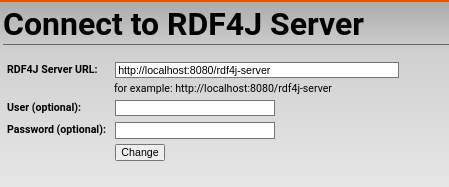
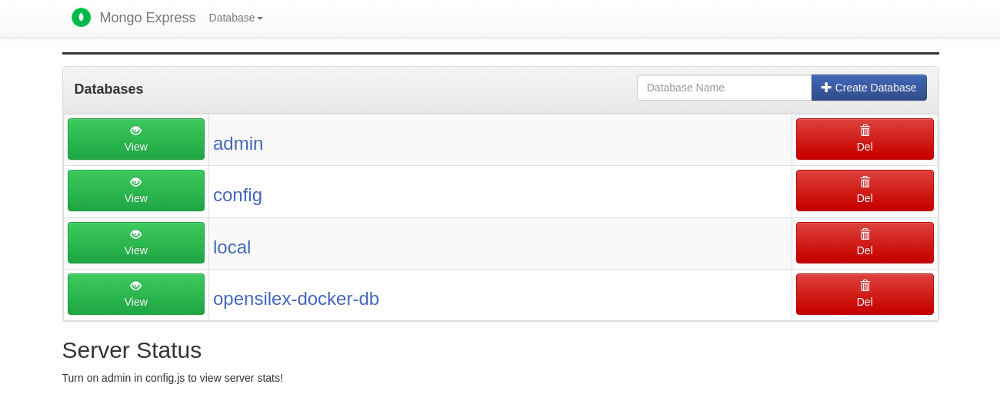
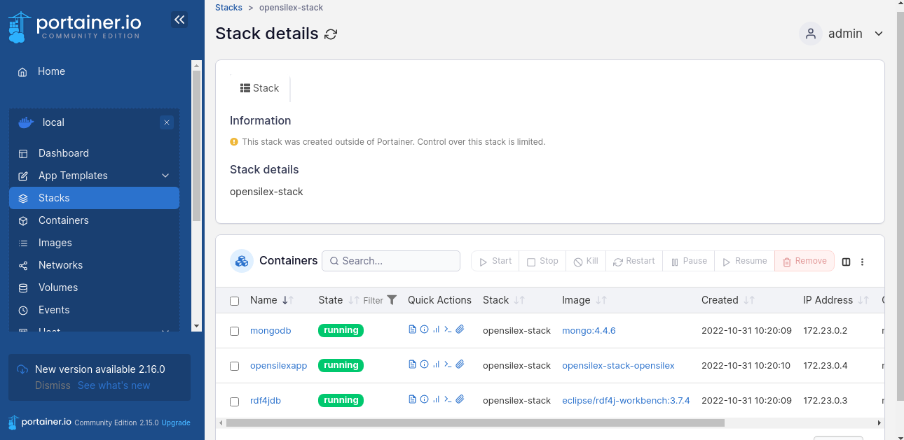

# Minimalist opensilex docker compose environment

<!-- add _target to all external link -->
<head>
  <base target="_blank">
</head>

Docker compose environnent to deploy opensilex stack based on a previous work <a href="https://github.com/p2m2/opensilex-phis-igepp" target="_blank">opensilex-phis-igepp</a>.

- [Minimalist opensilex docker compose environment](#minimalist-opensilex-docker-compose-environment)
  - [Pre-requesite softwares](#pre-requesite-softwares)
  - [Check your installed softwares](#check-your-installed-softwares)
  - [Stack software name with associated versions](#stack-software-name-with-associated-versions)
  - [Installation steps](#installation-steps)
    - [Fresh new install (compose v2)](#fresh-new-install-compose-v2)
  - [Run minimal opensilex docker stack compose](#run-minimal-opensilex-docker-stack-compose)
    - [(First install only) Create an administrator user](#first-install-only-create-an-administrator-user)
  - [Update opensilex version](#update-opensilex-version)
  - [Stop opensilex docker](#stop-opensilex-docker)
  - [Restart opensilex docker](#restart-opensilex-docker)
  - [Other tools or customizations](#other-tools-or-customizations)
    - [(Optional) Add a gui for opensilex-docker-mongodb](#optional-add-a-gui-for-opensilex-docker-mongodb)
    - [(Optional) Add a reverse proxy](#optional-add-a-reverse-proxy)
    - [Migration steps from previous versions](#migration-steps-from-previous-versions)
      - [From previous version 1.0.0-rc+5.2 (compose v2)](#from-previous-version-100-rc52-compose-v2)
      - [From previous version 1.0.0-rc+5.1 (compose v1)](#from-previous-version-100-rc51-compose-v1)
      - [From previous version before 1.0.0-rc+5.1 (compose v1)](#from-previous-version-before-100-rc51-compose-v1)
  - [Configure docker configuration](#configure-docker-configuration)
  - [Customize opensilex configuration](#customize-opensilex-configuration)
  - [Core module extensions](#core-module-extensions)
    - [Configuration for RDG module](#configuration-for-rdg-module)
  - [Modular extensions](#modular-extensions)
    - [Explanation of modules directory](#explanation-of-modules-directory)
    - [Configuration for inrae sixtine vigne](#configuration-for-inrae-sixtine-vigne)
  - [Manage data](#manage-data)
    - [Export (Experimental)](#export-experimental)
    - [Import (Experimental)](#import-experimental)
  - [Manage docker](#manage-docker)
  - [Debug installation](#debug-installation)
  - [Stop docker stack](#stop-docker-stack)
  - [Danger Zone](#danger-zone)
    - [Stop docker stack and erase all data (Be sure to delete all data)](#stop-docker-stack-and-erase-all-data-be-sure-to-delete-all-data)
  - [Acknowledgments](#acknowledgments)

## Pre-requesite softwares

**Tested Operating system :**

[](https://releases.ubuntu.com/22.04/)

[](https://www.debian.org/releases/bullseye/releasenotes)

_Not working operating system :_


First you need to have these software installed, you can check if they are [installed](#check-your-installed-softwares) :

- [Git](https://git-scm.com/book/en/v2/Getting-Started-Installing-Git)
- [docker](https://docs.docker.com/install/)
- [Docker Compose](https://docs.docker.com/compose/install/)

## Check your installed softwares

Following commands should work from everywhere in your system without errors:

`git --version`

`docker --version`

`docker compose version`

## Stack software name with associated versions

- Mandatory softwares :

  - RDF4J - 3.7.7
  - MongoDB - 5.0.28
  - OpenSILEX - 1.3.3

- Other managements softwares :
  - mongo-express (A web based gui for mongo) - 1.0.2-20
  - haproxy (web server used as reverse proxy) - 3.0.3

## Installation steps

This docker version is related to <a href="https://github.com/OpenSILEX/opensilex/releases/tag/1.3.3" target="_blank">1.3.3 OpenSILEX version</a>

### Fresh new install (compose v2)

Clone the repository to in order to get the project.

```bash
git clone --branch 1.3.3 https://github.com/OpenSILEX/opensilex-docker-compose
cd opensilex-docker-compose
```

For migration steps from previous versions, take a look to the [Migration steps from previous version](#migration-steps-from-previous-versions) section

## Run minimal opensilex docker stack compose

- With a bash terminal go to the project directory (where this readme is located).
- You must run docker compose up command to start your installation:

```bash
docker compose --env-file opensilex.env build --build-arg UID=$(id -u) --build-arg GID=$(id -g)
docker compose --env-file opensilex.env up start_opensilex_stack -d
```

- Expected Output:


```bash
WARN[0000] The "OPENSILEX_START_CMD_DEBUG" variable is not set. Defaulting to a blank string. 
WARN[0000] The "OPENSILEX_START_CMD_DEBUG" variable is not set. Defaulting to a blank string. 
[+] Running 4/10
 ⠸ Network opensilex-stack_default                    Created                                                                       2.3s 
 ⠸ Volume "opensilex-stack_persist_rdf4j_logs"        Created                                                                       2.2s 
 ⠸ Volume "opensilex-stack_persist_opensilex"         Created                                                                       2.2s 
 ⠸ Volume "opensilex-stack_haproxy_conf"              Created                                                                       2.2s 
 ⠹ Volume "opensilex-stack_persist_mongo_data"        Created                                                                       2.2s 
 ⠹ Volume "opensilex-stack_persist_rdf4j_data"        Created                                                                       2.2s 
 ✔ Container opensilex-docker-mongodb                 Started                                                                       1.0s 
 ✔ Container opensilex-docker-rdf4j                   Started                                                                       1.0s 
 ✔ Container opensilex-docker-opensilexapp            Started                                                                       1.5s 
 ✔ Container opensilex-stack-start_opensilex_stack-1  Started  
 ```

- Check if opensilex is launched: 

```bash
docker logs opensilex-docker-opensilexapp 
```

- Expected Output:
  
These lines must be written in the docker logs.

```bash
INFO: No Spring WebApplicationInitializer types detected on classpath
Feb 26, 2024 10:00:06 PM org.apache.coyote.AbstractProtocol start
INFO: Starting ProtocolHandler ["http-nio-8081"]
```

### (First install only) Create an administrator user

Docker volumes are persistent until you remove them. You only need to create once an user.

```bash
docker exec -it opensilex-docker-opensilexapp ./bin/opensilex.sh user add --admin --email=admin@opensilex.org --lang=fr --firstName=firstName --lastName=lastName --password=admin
```

After opensilex start you will be able to access to the application on port <a href="http://localhost:28081/sandbox/app" target="_blank">localhost:28081/sandbox/app</a>.

By default, different available services can be found at these adresses :

- OpenSILEX web application : <a href="http://localhost:28081/sandbox/app" target="_blank">http://localhost:28081/sandbox/app</a>
- OpenSILEX API : <a href="http://localhost:28081/sandbox/api-docs" target="_blank">http://localhost:28081/sandbox/api-docs</a>
- MongoDB port : <a href="http://localhost:28888" target="_blank">http://localhost:28888</a>
- RDF4J Workbench : <a href="http://localhost:28887/rdf4j-workbench" target="_blank">http://localhost:28887/rdf4j-workbench</a>

_PS: At the first connection, you will need to change rdf4j server port to 8080 (internal docker port) in order to access to rdf4j repositories._

Expected configuration :



## Update opensilex version

> Warning ! Before updating, if you already have a running version, please check the migration guides
> between releases. You can find the migration instructions in the changelog for each release
> (https://github.com/OpenSILEX/opensilex/tree/master/opensilex-doc/src/main/resources/release).

You can do it in two steps : 

- By modifying _opensilex.env_ file with this following configuration you will be able to change.

```bash
# Choose opensilex version.
# VERSIONS 
OPENSILEX_RELEASE_TAG=1.2.0
# Ex: OPENSILEX_RELEASE_TAG=1.2.1-rdg or OPENSILEX_RELEASE_TAG=1.2.1
```

- You will be able to restart opensilex container only by running the following command.

```bash
docker compose --env-file=opensilex.env up --force-recreate --no-deps opensilex -d
```

## Stop opensilex docker

This command will stop the stack.

```bash
docker stop opensilex-docker-opensilexapp
```

## Restart opensilex docker

This command will restart the opensilex service.

```bash
docker compose --env-file=opensilex.env up --force-recreate --no-deps opensilex -d
```

## Other tools or customizations

### (Optional) Add a gui for opensilex-docker-mongodb

This will start the mongo express server that helps you do explore your mongo data on port [localhost:28889/mongoexpress](http://localhost:28889/mongoexpress). You can also use your own robo3t or Mongo Compass App.

Before run mongoexpress, please configure admin and password of mongo-express.

```bash
ME_CONFIG_BASICAUTH_USERNAME=  
ME_CONFIG_BASICAUTH_PASSWORD=  
#default
#ME_CONFIG_BASICAUTH_USERNAME=adminexpress
#ME_CONFIG_BASICAUTH_PASSWORD=admin
```

```bash
docker compose --env-file opensilex.env up --no-recreate   start_opensilex_stack_mongogui -d
```



### (Optional) Add a reverse proxy

This will start the haproxy as reverse proxy for opensilex instance on port that you want to expose.

It can be configure in the `./opensilex.env` with the variable `HAPROXY_EXPOSED_PORT` (Default to port 80 equivalent to <a href="http://localhost" target="_blank">http://localhost</a>.

```bash
docker compose --env-file opensilex.env up --no-recreate start_opensilex_stack_proxy -d

```

If you have installed [optional reverse proxy](#optional-add-a-reverse-proxy)

By default, different available services can be found at these adresses. The port might be change depending on your `./opensilex.env` configuration file.

- Web :
  - OpenSILEX web application : <a href="http://localhost:8087/sandbox/app/" target="_blank">http://localhost:8087/sandbox/app/</a>
  - OpenSILEX API : <a href="http://localhost:8087/sandbox/api-docs" target="_blank">http://localhost:8087/sandbox/api-docs</a>
  - RDF4J Workbench : <a href="http://localhost:8087/rdf4j-workbench" target="_blank">http://localhost:8087/rdf4j-workbench</a>

Mongo express will be automatically installed [(Optional) Add a gui for opensilex-docker-mongodb](#optional-add-a-gui-for-opensilex-docker-mongodb)

- MongoDB express : <a href="http://localhost:8087/mongoexpress" target="_blank">http://localhost:8087/mongoexpress</a>

### Migration steps from previous versions

First, go to the previous directory and get the actual version of the repository.

```bash
# Go inside opensilex-docker-compose directory
git checkout 1.3.3
```

#### From previous version 1.0.0-rc+5.2 (compose v2)

If you had a previous installation go to the directory where the project have been clone.
And execute the following command to remove previous docker stack :

```bash
# Remove old containers
docker stop mongodb && docker rm mongodb
docker stop opensilexapp && docker rm opensilexapp
docker stop rdf4jdb && docker rm rdf4jdb
docker stop haproxy && docker rm haproxy
docker stop mongoexpressgui && docker rm mongoexpressgui
```

#### From previous version 1.0.0-rc+5.1 (compose v1)

If you had a previous installation go to the directory where the project have been clone.
And execute the following command to remove previous docker stack :

```bash
# Remove old containers
docker stop mongodb && docker rm mongodb
docker stop opensilexapp && docker rm opensilexapp
docker stop rdf4jdb && docker rm rdf4jdb
docker stop haproxy && docker rm haproxy
docker stop mongoexpressgui && docker rm mongoexpressgui
```

#### From previous version before 1.0.0-rc+5.1 (compose v1)

If you had a previous installation go to the directory where the project have been clone.
And execute the following command to remove previous docker stack :

```bash
# Remove old containers
docker stop mongodb && docker rm mongodb
docker stop opensilex && docker rm opensilex
docker stop rdf4j && docker rm rdf4j
```

## Configure docker configuration

Configure `opensilex.env` file to configure opensilex sparql config, applications ports, applications volumes

```bash
# CAN BE MODIFIED BY USER

## START COMMAND can had debug option by uncommenting the following statment
# OPENSILEX_START_CMD_DEBUG=--DEBUG

# SPARQL
BASEURI=http://opensilex.test/
BASEURIALIAS=opensilex-sandbox
# customize path prefix Ex : localhost:28081/sandbox or localhost:8081/phenotyping_si
OPENSILEX_PATH_PREFIX=sandbox
VERSION_LABEL=test-version
OPENSILEX_PUBLIC_URL=http://localhost:28081/ # public url for web api

# FILE SYSTEM
# Default value is "gridfs" - Only "gridfs" or "local" are supported
OPENSILEX_FILESYSTEM=gridfs
DATAFILE_OPENSILEX_FILESYSTEM=gridfs
DOCUMENTS_OPENSILEX_FILESYSTEM=gridfs   
# If "local" file system is choosed OPENSILEX_LOCAL_FILE_SYSTEM_DIRECTORY is mandatory if you choose gridfs local will be not used
# File system configuration can be customized to opensilex-template.yml
OPENSILEX_LOCAL_FILE_SYSTEM_DIRECTORY=./opensilex_data
#Ex :
#OPENSILEX_LOCAL_FILE_SYSTEM_DIRECTORY=/home/charlero/GIT/GITLAB/opensilex-docker-compose/dump_scripts/demo_dump/publictest

# PORTS
HAPROXY_EXPOSED_PORT=8087
OPENSILEX_EXPOSED_PORT=28081
RDF4J_EXPOSED_PORT=28887
MONGO_EXPOSED_PORT=28888
MONGO_EXPRESS_EXPOSED_PORT=28889

## START COMMAND can had debug option : --DEBUG
OPENSILEX_START_CMD=./bin/opensilex.sh server start --host=localhost --port=8081 --adminPort=4081 --CONFIG_FILE=/home/opensilex/config/opensilex.yml

# VERSIONS
HAPROXY_IMAGE_VERSION=2.6.6
OPENSILEX_RELEASE_TAG=1.2.1
RDF4J_IMAGE_VERSION=3.7.7
MONGO_IMAGE_VERSION=5.0.19
MONGO_EXPRESS_IMAGE_VERSION=1.0.0-alpha.4
 
# # THEME
OPENSILEX_CONFIG_THEME=opensilex-front#opensilex
OPENSILEX_CONFIG_HOMECOMPONENT=opensilex-HomeView
OPENSILEX_CONFIG_LOGINCOMPONENT=opensilex-DefaultLoginComponent
OPENSILEX_CONFIG_FOOTERCOMPONENT=opensilex-DefaultFooterComponent
OPENSILEX_CONFIG_MENUCOMPONENT=opensilex-DefaultMenuComponent
OPENSILEX_CONFIG_HEADERCOMPONENT=opensilex-DefaultHeaderComponent

# Example of modification
#OPENSILEX_CONFIG_THEME=inrae-sixtine-vigne#vigne
#OPENSILEX_CONFIG_HOMECOMPONENT=inrae-sixtine-vigne-SixtineHomeComponent
#OPENSILEX_CONFIG_LOGINCOMPONENT=inrae-sixtine-vigne-SixtineLoginComponent
#OPENSILEX_CONFIG_FOOTERCOMPONENT=inrae-sixtine-vigne-SixtineFooterComponent
#OPENSILEX_CONFIG_MENUCOMPONENT=inrae-sixtine-vigne-SixtineMenuComponent
#OPENSILEX_CONFIG_HEADERCOMPONENT=inrae-sixtine-vigne-SixtineHeaderComponent
```

## Customize opensilex configuration

Configure `config/opensilex-custom-config.yml` file to activate [custom features](https://github.com/OpenSILEX/opensilex/tree/master/opensilex-doc/src/main/resources/installation/configuration).

Example : Activate and calculated metrics each 2 hours.

```bash

# ------------------------------------------------------------------------------
# Configuration for module: CoreModule (CoreConfig)
core:
  # Metrics options (MetricsConfig)
  metrics:
    # Activate access metrics (boolean)
    enableMetrics: true
    # Metrics configs about system (SystemMetricsConfig)
    system:
      # First metrics for any time depending on is time unit (int)
      timeBeforeFirstMetric: 1
      # Delay between whole system metrics (combined with corresponding TimeUnit) (int)
      delayBetweenMetrics: 2
      # Default metrics units : DAYS, HOURS, MINUTES, SECONDS are authorized (String)
      metricsTimeUnit: HOURS
    # Metrics configs about experiments (ExperimentsMetricsConfig)
    experiments:
      # First metrics for any time depending on is time unit (int)
      timeBeforeFirstMetric: 1
      # Delay between whole system metrics (combined with corresponding TimeUnit) (int)
      delayBetweenMetrics: 2
      # Default metrics units : DAYS, HOURS, MINUTES, SECONDS are authorized (String)
      metricsTimeUnit: HOURS
```

## Core module extensions

Other modules can be activated by modifiyng OPENSILEX_RELEASE_TAG version (Example : RDG module).

### Configuration for RDG module

By modifying _opensilex.env_ file with this following configuration you will be able to activate rdg module.
For more configuration, see [RDG module configuration](https://github.com/OpenSILEX/opensilex/blob/master/opensilex-doc/src/main/resources/modules/dataverse.md).

```bash
# Example of modification for RDG module
# VERSIONS
HAPROXY_IMAGE_VERSION=2.6.6
OPENSILEX_RELEASE_TAG=1.2.1-rdg
RDF4J_IMAGE_VERSION=3.7.7
MONGO_IMAGE_VERSION=5.0.19
MONGO_EXPRESS_IMAGE_VERSION=1.0.0-alpha.4
```

## Modular extensions

### Explanation of modules directory

Module (opensilex jar) can be added to _"modules"_ directory (opensilex-docker-compose/modules) in order to be deployed in opensilex stack.

There is a module example directory working with _"inrae-sixtine-vigne"_ module (inrae-sixtine-vigne-1.1.0.jar) that allow you to change ontology and instance front style.
It is localised in opensilex-docker-compose/modules_examples/1.0.0-rc+6.5/inrae-sixtine-vigne-1.1.0.jar.

**How to do it ?**

- To activate your module you must copy a module example that have been compiled for a specified opensilex version in _modules_ directory. (Ex : the module located in 1.0.0-rc+6.5/inrae-sixtine-vigne-1.1.0.jar has been compiled for opensilex version 1.0.0-rc+6.5). It's all.

### Configuration for inrae sixtine vigne

By modifying _opensilex.env_ file with this following configuration you will be able to change the theme.

```bash
# Example of modification for sixtine vigne module
OPENSILEX_CONFIG_THEME=inrae-sixtine-vigne#vigne
OPENSILEX_CONFIG_HOMECOMPONENT=inrae-sixtine-vigne-SixtineHomeComponent
OPENSILEX_CONFIG_LOGINCOMPONENT=inrae-sixtine-vigne-SixtineLoginComponent
OPENSILEX_CONFIG_FOOTERCOMPONENT=inrae-sixtine-vigne-SixtineFooterComponent
OPENSILEX_CONFIG_MENUCOMPONENT=inrae-sixtine-vigne-SixtineMenuComponent
OPENSILEX_CONFIG_HEADERCOMPONENT=inrae-sixtine-vigne-SixtineHeaderComponent
```

## Manage data

File system management are not shown in the the following steps because local files are manage with bind volumes or with gridfs. Other file systems are not managed in this version of opensilex docker.

### Export (Experimental)

This script will dumps mongodb and rdf4j data in a directory with this structure.

```bash

# Step 1
cd <opensilex-docker-compose-dir>/dump_scripts
# Example directory structure <opensilex-docker-compose-dir>/dump_scripts/dump_example_structure
# ├── mongodb
# │   └── opensilex-docker-db-2022-11-21
# └── rdf4j
#     └── opensilex-docker-db-2022-11-21
sh export_data.sh <path_to_data>
```

### Import (Experimental)

This script will restore mongodb and rdf4j data in a directory with this structure.

```bash
# Step 1
cd <opensilex-docker-compose-dir>/dump_scripts
# Example directory structure <opensilex-docker-compose-dir>/dump_scripts/dump_example_structure
# ├── mongodb
# │   └── opensilex-dump-db-2022-11-21
# └── rdf4j
#     └── opensilex-dump-db-2022-11-21
sh import_data.sh <path_to_data>
```

## Manage docker

In order to manage your docker stack via an web interface, we suggest you to use <a href="https://docs.portainer.io/start/install/server/docker/linux#deployment" target="_blank">Portainer Community edition edition</a>



## Debug installation

This command will give you stack trace of the docker build.

```bash
docker compose --env-file opensilex.env build --build-arg UID=$(id -u) --build-arg GID=$(id -g) > docker_logs/debug.log
```

## Stop docker stack

This command will stop the docker stack.

```bash
docker compose --env-file opensilex.env down
```

## Danger Zone

$\color{red}{The\ following\ commands\ may\ produce\ a\ loss\ of\ data}$

### Stop docker stack and erase all data (Be sure to delete all data)

This command will stop docker stack and erase all data in your databases.

```bash
docker compose --env-file opensilex.env down --volumes
# this command will erase all the data
```

## Acknowledgments

Olivier Fangi & Co - <a href="https://github.com/p2m2" target="_blank">P2M2 Team</a>
